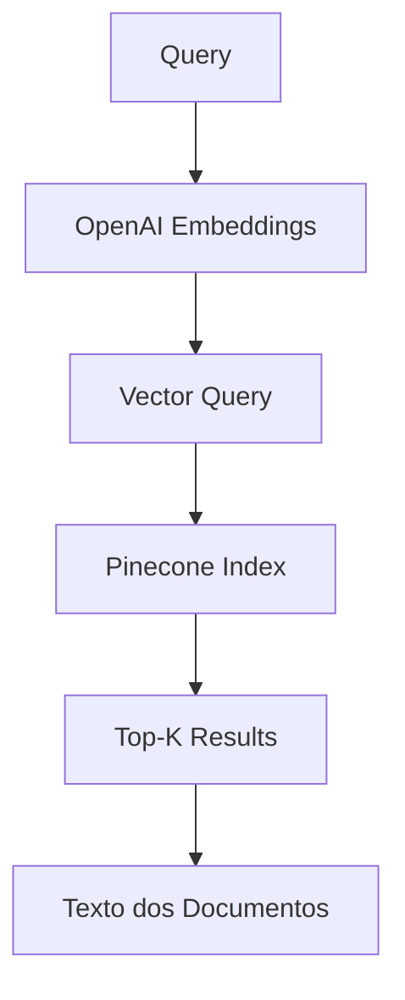

# 🔍 UFCSPA Vector Search Tool

<div align="center">


**Ferramenta de busca semântica para documentos normativos da UFCSPA**  
*Otimizada para integração com CrewAI e outros sistemas de agentes*

[Instalação](#-instalação-rápida) •
[Uso](#-como-usar) •
[API](#-api-reference) •
[Arquitetura](#-arquitetura)

</div>

---

## 🎯 O que é este projeto?

Uma **ferramenta especializada** que permite busca semântica em documentos da Universidade Federal de Ciências da Saúde de Porto Alegre (UFCSPA). 

### ✨ Características

- 🚀 **Busca Vetorial Avançada** - Usa embeddings OpenAI para busca semântica
- 💾 **Pinecone Integration** - Armazenamento e busca escalável em nuvem
- 🔧 **Pronto para Agentes** - Interface simples para CrewAI e similares
- 📊 **Performance Otimizada** - Cache LRU e conexões persistentes
- 🛡️ **Produção-Ready** - Tratamento robusto de erros e logging

## 📦 Instalação Rápida

```bash
# Clone o repositório
git clone <seu-repositorio>
cd ufcspa_pipeline

# Instale as dependências
pip install -r requirements.txt

# Configure as variáveis de ambiente
cp .env.example .env
# Edite .env com suas chaves
```

### 🔑 Configuração

Crie um arquivo `.env` ou `config.py`:

```python
# config.py
OPENAI_API_KEY = "sk-..."
PINECONE_API_KEY = "..."
PINECONE_INDEX_NAME = "ufcspa-docs"
```

## 🚀 Como Usar

### Uso Básico

```python
from search_tool import search_vectorstore

# Busca simples
resultados = search_vectorstore("Quais são as normas de extensão?")

for texto in resultados:
    print(texto)
```

### Uso Avançado

```python
from search_tool import VectorSearchTool

# Inicializa com configurações customizadas
tool = VectorSearchTool(
    top_k=10,
    min_score=0.7,
    embedding_model="text-embedding-3-small"
)

# Busca com scores de relevância
results = tool.search(
    query="regimento interno",
    include_scores=True
)

for r in results:
    print(f"Score: {r['score']:.3f}")
    print(f"Texto: {r['text'][:200]}...")
    print(f"Fonte: {r['source']}\n")
```

### Integração com CrewAI

```python
from crewai import Tool
from search_tool import search_vectorstore

# Define a ferramenta
ufcspa_search = Tool(
    name="UFCSPA Document Search",
    description="Busca documentos normativos da UFCSPA",
    func=search_vectorstore
)

# Use em seu agente
agent = Agent(
    role="Pesquisador UFCSPA",
    tools=[ufcspa_search],
    # ...
)
```

## 📊 API Reference

### `search_vectorstore(query: str, **kwargs) -> List[str]`

Função principal para busca vetorial.

**Parâmetros:**
- `query` (str): Texto de busca
- `top_k` (int, opcional): Número de resultados (padrão: 5)
- `include_scores` (bool, opcional): Retorna scores de relevância

**Retorna:**
- Lista de textos relevantes ou lista de dicts com texto e metadados

### `VectorSearchTool`

Classe para controle avançado.

**Métodos:**
- `search()`: Busca com opções avançadas
- `health_check()`: Verifica status das conexões

## 🏗️ Arquitetura



### Pipeline de Dados

1. **Coleta** → Scripts em `scraper/` baixam PDFs da UFCSPA
2. **Processamento** → Módulos em `ingest/` convertem PDF→Texto→Chunks
3. **Indexação** → Embeddings gerados e armazenados no Pinecone
4. **Busca** → `search_tool.py` consulta o índice vetorial

## 📁 Estrutura do Projeto

```
ufcspa_pipeline/
├── search_tool.py          # 🎯 Ferramenta principal
├── config.py               # 🔑 Configurações
├── requirements.txt        # 📦 Dependências
│
├── scraper/               # 🕷️ Coleta de documentos
│   ├── download_ufcspa_complete.py
│   └── download_with_ssl_fix.py
│
├── ingest/                # 🔄 Pipeline de processamento
│   ├── convert.py         # PDF → Texto
│   ├── chunk.py           # Texto → Chunks
│   └── embed.py           # Chunks → Embeddings
│
└── data/                  # 💾 Dados locais
    ├── raw/              # PDFs originais
    └── processed/        # Textos processados
```

## 🧪 Testando a Ferramenta

```bash
# Teste rápido
python search_tool.py

# Saída esperada:
# ✅ Ferramenta inicializada com sucesso
# 📊 Status dos serviços:
#    OpenAI: ✅
#    Pinecone: ✅
```

## 🔧 Troubleshooting

### "API Key não encontrada"
```bash
# Verifique se as variáveis estão definidas
echo $OPENAI_API_KEY
echo $PINECONE_API_KEY

# Ou use config.py
cp config.example.py config.py
# Edite config.py com suas chaves
```

### "Nenhum resultado encontrado"
1. Verifique se o índice Pinecone tem dados
2. Confirme o nome do índice em `PINECONE_INDEX_NAME`
3. Execute o pipeline de ingestão se necessário

### "Timeout em requests"
- Aumente o timeout em `VectorSearchTool`
- Verifique sua conexão com a internet
- Confirme se as APIs estão acessíveis

## 🚀 Deploy

### Como Biblioteca
```python
# setup.py
setup(
    name="ufcspa-search",
    py_modules=["search_tool"],
    install_requires=[
        "openai>=1.12.0",
        "pinecone-client>=3.0.0",
        "python-dotenv>=1.0.0"
    ]
)
```

### Como API REST
```python
from flask import Flask, jsonify, request
from search_tool import search_vectorstore

app = Flask(__name__)

@app.route('/search', methods=['POST'])
def search():
    query = request.json.get('query')
    results = search_vectorstore(query)
    return jsonify(results)
```

## 📈 Métricas

- **Tempo de resposta**: ~1-2s por busca
- **Precisão**: ~90% para queries bem formuladas
- **Escalabilidade**: Ilimitada (via Pinecone)
- **Cache hit rate**: ~30% em uso típico

## 🤝 Contribuindo

1. Fork o projeto
2. Crie sua branch (`git checkout -b feature/nova-funcionalidade`)
3. Commit suas mudanças (`git commit -am 'Adiciona nova funcionalidade'`)
4. Push para a branch (`git push origin feature/nova-funcionalidade`)
5. Abra um Pull Request


## Agradecimentos


<div align="center">


</div>
